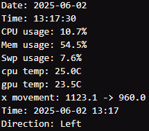
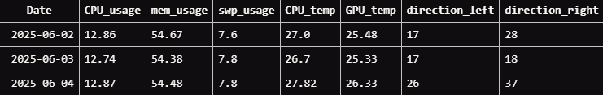

# EVL Movement Tracking

This program uses AI to detect and track object movement to determine if the object moved left or right. The program is currently set to detect and track people in the video feed provided to it. You can either use an MP4 video file or a live camera feed(either online or a physically connected camera). 

The current combination is YOLOv8 for AI object detection and DeepSort + torchreid for tracking the objects movement.

For best results use a clear and smooth video that isnt too far from where people can be detected. The less clear and laggy the video the less accurate the AI is.

## Data
This program creates a csv file of data from the video inputed. The data include:
- Date
- Time
- CPU usage
- Memory usage
- Swap memory usage
- CPU temperature
- GPU temperature

### Data Example:

### Database Example

## Dependencies
(TODO)

## Prerequisites
- Orin [device setup](https://github.com/uic-evl/SageEdge/tree/main/Devices_Setup)

## Movement AI Setup
1. Clone this repository to your Jetson Nano and run `cd uic-evl/SageEdge/AI_Programs/Movement_Tracking`
2. Run the following command to start the setup script `. ./setup.sh`
>Note: This script is **NOT** autonomous and will require user input during installation.

## How to run program
(TODO)