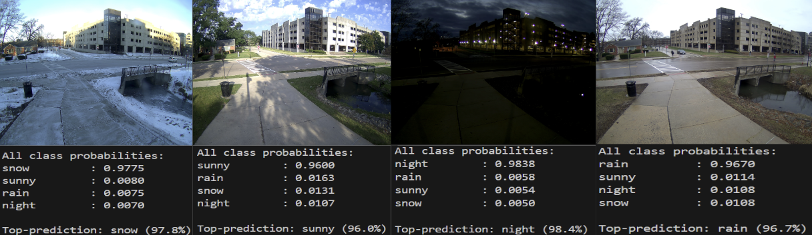

# EVL Weather Detection

This program uses AI to detect and determine current weather conditions. The program is currently set to analyze an image and determine the condition. You can either use an image, MP4 video file, or a live camera feed(either online or a physically connected camera). 

The current model is a fine tuned Google VIT AI mode.

For best results use a clear and smooth video/image. The less clear and laggy the video/image the less accurate the AI is.

## Dependencies
- torch
- torchvision 
- transformers 
- accelerate
- timm 
- opencv-python 
- Pillow 
- numpy 
- requests 

## Prerequisites
- Orin [device setup](https://github.com/uic-evl/SageEdge/tree/main/Devices_Setup)

## Weather AI Setup
1. Clone this repository to your Jetson Nano and run `cd uic-evl/SageEdge/AI_Programs/Weather_detection`
2. Run the following command to start the setup script `. ./setup.sh`
>Note: This script is **NOT** autonomous and will require user input during installation.
