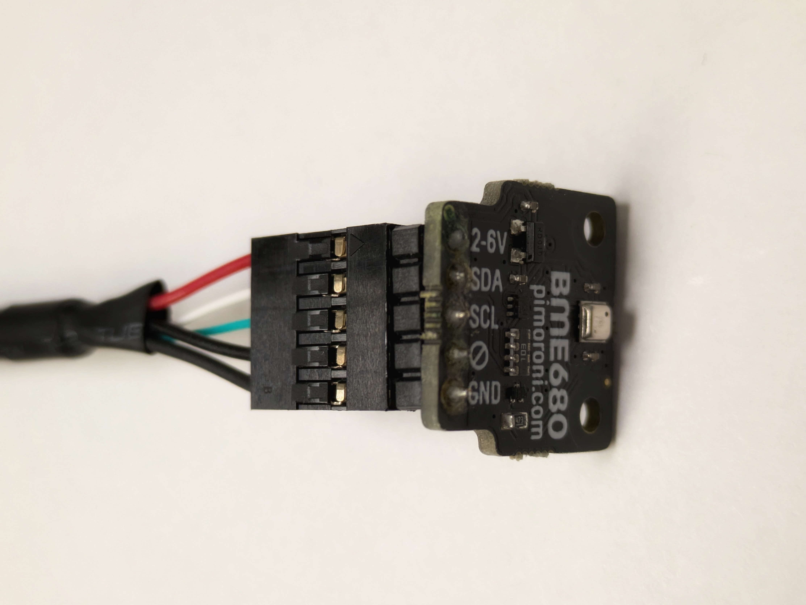
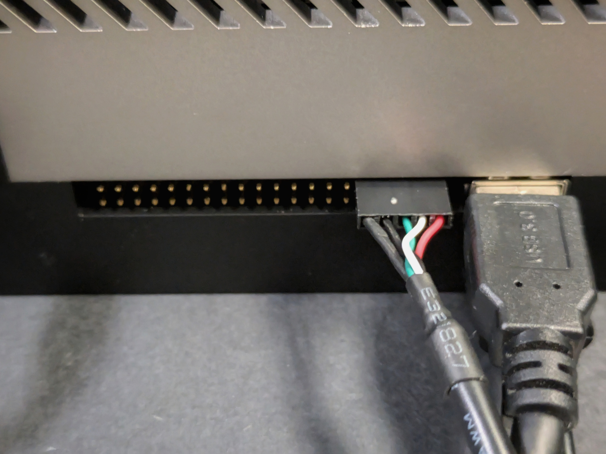
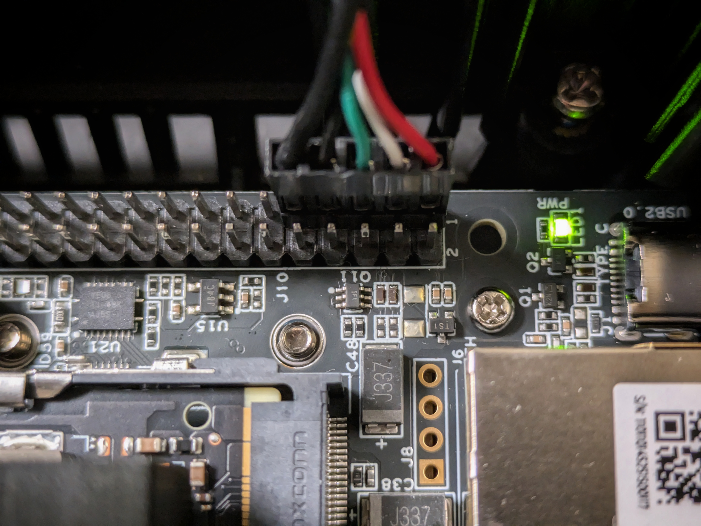
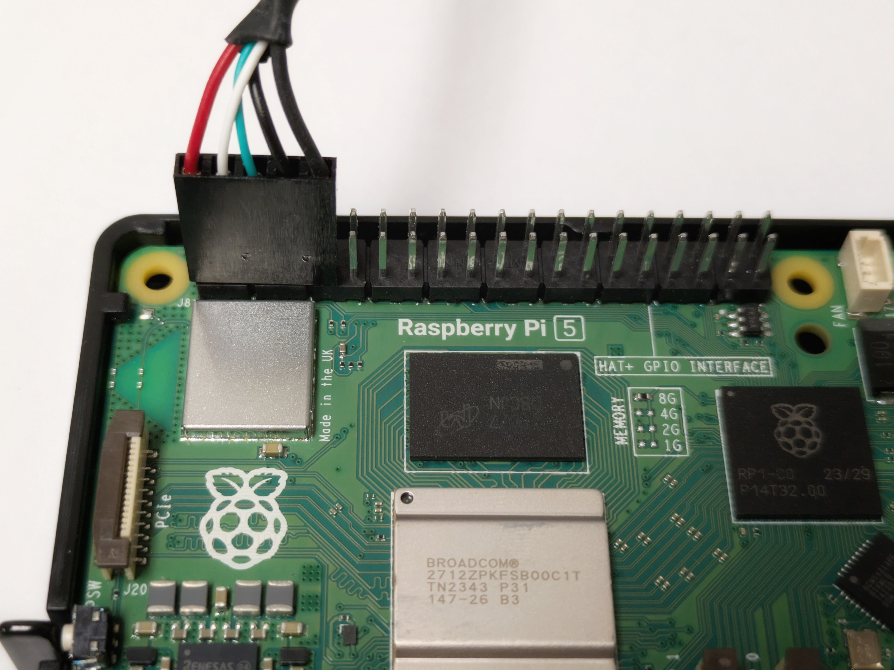

# Configuring the BME680 Environmetal Sensor


1. Connect in the five-pin USB cable to the environmental sensor with the black wire connected to the ground pin.
  </img>

2. **With the device powered off**, connect the other end of the five-pin USB cable into the pins shown in the images below of your specific device. Please make sure and take note of which color wire is connected to which pin.
    
 **NVIDIA Jetson AGX Orin** 
 
  </img>
  ---
 **reComputer J4012** 
 
  </img>
  ---
  **Raspberry Pi**
  
  </img>
  ---


4. Run this command to see if the sensor is being detected by i2c. `i2cdetect -y -r 7 0x76 0x77`

    ```bash
    waggle@wd-nanocore-000048B02D5BFE58:~# i2cdetect -y -r 7 0x76 0x77
        0  1  2  3  4  5  6  7  8  9  a  b  c  d  e  f
    00:                                                 
    10:                                                 
    20:                                                 
    30:                                                 
    40:                                                 
    50:                                                 
    60:                                                 
    70:                   76 -- 
    ```
> Note: **The sensor can either be on 0x76 or 0x77**. Based on what address it's on the number will change in the documentation

4.  The kernel supplied by nvidia doesn't support the BME680 sensor, so we just have to get the kernel source of a kernel version supporting the sensor (5.15.148)
`wget https://www.kernel.org/pub/linux/kernel/v5.x/linux-5.15.148.tar.gz`

5.  Extract the drivers/iio/chemical subtree of the kernel source for building the bme680 sensors kernel module
`tar --strip-components=3 -xvzf linux-5.15.148.tar.gz linux-5.15.148/drivers/iio/chemical`

6.  After extracting, we have to configure the build. To do so, prepend the following lines to the Makefile in this subtree `vim linux-5.15.148/drivers/iio/chemical/Makefile`

    ```
    CONFIG_BME680=m
    CONFIG_BME680_I2C=m
    ```
7. **This line is only to be ran on seeed studio orin**
This command creates a symbolic link (a shortcut) to the kernel headers. The command points the standard kernel build location (/lib/modules/$(uname -r)/build) to the specific location where the kernel source files are stored on this device.
'sudo ln -sfT /usr/src/linux-headers-5.15.148-tegra-ubuntu22.04_aarch64/3rdparty/canonical/linux-jammy/kernel-source /lib/modules/$(uname -r)/build'
8.  Afterwards build the kernel module and install the binaries to the modules folder by running the following commands:

    1. `make -C /lib/modules/$(uname -r)/build M=$PWD`

    2. `sudo make -C /lib/modules/$(uname -r)/build M=$PWD modules_install`

9.  Build the module's dependency list by running the command `depmod -a`

10.  Run command `modprobe bme680_i2c` to see if the module was successfully installed
> Note: If there is no output then the module was installed correctly

11.  To use the sensor we have to register it with the kernels i2c subsystem so run this command `echo bme680 0x76 | sudo tee /sys/bus/i2c/devices/i2c-7/new_device`
> Note: change number to 77 if that's the address the sensor is on

12. Check if the BME680 sensor is registered by running the command `cat /sys/bus/iio/devices/*/name`

    ```bash
    waggle@<id>:~# cat /sys/bus/iio/devices/*/name

    ina3221x
    bme680
    ```

13.  Once the sensor is registered, the sensors readings can be acquired using the `sysfs` interface:

        ```bash
        waggle@<id>:~#  grep ^ /dev/null /sys/bus/i2c/devices/i2c-7/1-0076/iio:device1/*input*

        /sys/bus/i2c/devices/i2c-7/1-0076/iio:device1/in_humidityrelative_input:63.827000000
        /sys/bus/i2c/devices/i2c-7/1-0076/iio:device1/in_pressure_input:984.630000000
        /sys/bus/i2c/devices/i2c-7/1-0076/iio:device1/in_resistance_input:7234
        /sys/bus/i2c/devices/i2c-7/1-0076/iio:device1/in_temp_input:24510
        ```
> Note: If your sensor is on 0x77 the relative path will be `/sys/bus/i2c/devices/i2c-7/1-0077/iio:device1/*input*`

14. If your outputs in steps 11 & 12 are similar then configure the nano to set bme680 on boot

    1. To load the bme680_i2c kernel module on startup add it to the modules.conf file by running this command `echo bme680_i2c >> /etc/modules-load.d/modules.conf`

    2. Next, we have to register the sensor with the kernels i2c subsystem on startup. To do so we have to create a rc.local file since ubuntu 18.04 doesn't have it by default. `vim /etc/rc.local`

        1. Go into insert mode, and paste the following content

            ```bash
            #!/bin/sh -e
            #
            # rc.local
            #
            # This script is executed at the end of each multiuser runlevel.
            # Make sure that the script will "exit 0" on success or any other
            # value on error.
            #
            # In order to enable or disable this script just change the execution
            # bits.
            #
            # By default this script does nothing.

            # Add bme680 to i2c
            echo bme680 0x76 > /sys/bus/i2c/devices/i2c-7/new_device

            exit 0
            ```

        2. Escape insert mode, save and quit file

        3. Give execution permission to the file `chmod +x /etc/rc.local`

15. Reboot and on startup run steps 11 & 12 again to see if the BME680 sensor is set up on boot

---

Continue to the [Waggle docs](https://docs.waggle-edge.ai/docs/about/overview) or the [Optional Tests to run](./test_nano.md)
