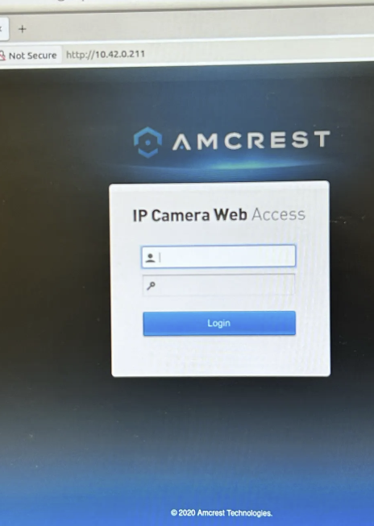

1. Flash the NVIDIA Jetson with Jetpack 6.2.1 using NVIDIA SDK manager on an Ubunut device (for us its the Intel NUC). Follow the steps [here](https://developer.nvidia.com/embedded/learn/jetson-agx-orin-devkit-user-guide/two_ways_to_set_up_software.html).
   1. Make sure the power cable is connected to the side with all the ports.
   
   2. When connecting the usb-c that is connected to the Ubuntu device for flashing connect it into the type-c port on the side with the pins.
   
   
   3. When flashing you will have options on what components to flash the Jetson device with. The first section will be selected by default, but you need to select the `Jetson SDK Components` section as well.
     
   
   4. Once you start flashing the Jetson you will get a screen that looks like this:
     
     
     1. This screen will ask you to input the IP Address, Username, and Password.
     
     2. To get the IP Address of your Jetson go on the Jetson's terminal and type `ifconfig` this will show you a list of IP addresses and the one you want should either be the wifi or ethernet IP and you want the `inet` address. It will look something like this:
     

     3. The Username and Password should be `Waggle` and `Waggle`.
     
     4. Select `Do not set proxy` and it should let you install.

     5. If you get an error `Could not detect a board` go on the Jetson and reboot it or connect to it via ethernet cable using the USB adapter.

2. Connect the external hardware and setup:
   1. Once you setup on the Jetson go on it and in the terminal run the command `sudo apt update` then `sudo apt upgrade`
         1. To download a browser go on the software store and download a broswer (ex. FireFox).
         2. If the browser does not run when it downloads you will need to downgrade snapd. Follow these commands.
                    
                    snap download snapd --revision=24724
                    sudo snap ack snapd_24724.assert
                    sudo snap install snapd_24724.snap
                    sudo snap refresh --hold snapd
   
   2. Microphone:
         1. Connect the microphone to the Jetson via USB. Make sure the light on the microphone lights up.
   3. Camera:
        1.  Connect the camera (ex: Amcrest camera) via Ethernet cable to the Jetson. Once connected go to wired connection in settings find the device that is 100/mb speed and go into the setting. Click on IPv4 and choose "Shared to other computers"

        
        
        2.  To find IP of the Jetson download arp using `sudo apt install net-tools` then use `arp -a` inside the terminal once you connected the camera. This should find the IP of the camera, look at the terminal to find the IP of ethernet. (ex. `? (10.42.0.211) at 9c:8e:cd:31:e3:6f [ether] on eno1`) 
        
        
        
        3.  Copy and paste the IP of the camera to a search browser (such as firefox) and if an Amcrest page pops up the camera is connected!
   4. BME Sensor:
        1.  Please follow the BME sensor setup guide on [sensor setup github](https://github.com/uic-evl/SageEdge/blob/main/EDU_SetUp/configuring_env_sensor.md).
3. Set up the AI program by following the steps from the [setup github](https://github.com/uic-evl/SageEdge/tree/main/AI_Programs/Movement_Tracking).
